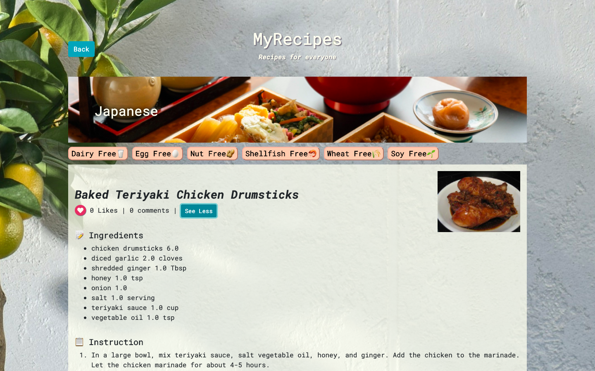

# MyRecipes 🍽

## About
Email newsletter tool built with React and Ruby on Rails.

Key features:

* send email campaigns.
* track the stats of the campaigns (open rate, click rate, unsubscribe, spam report, etc.)
* import contacts from spreadsheets
* manage and categorize contacts

## Demo

[Video](https://www.youtube.com/watch?v=lAlcbW7LLvw&feature=youtu.be)

## Technologies and stack

* Frontend: React, React Redux, Reactstrap
* Backend: Ruby/Ruby on Rails
* Database: Postgresql
* Email Sender: SendGrid
* Template Editor: CKEditor
* Data visualization: amCharts
